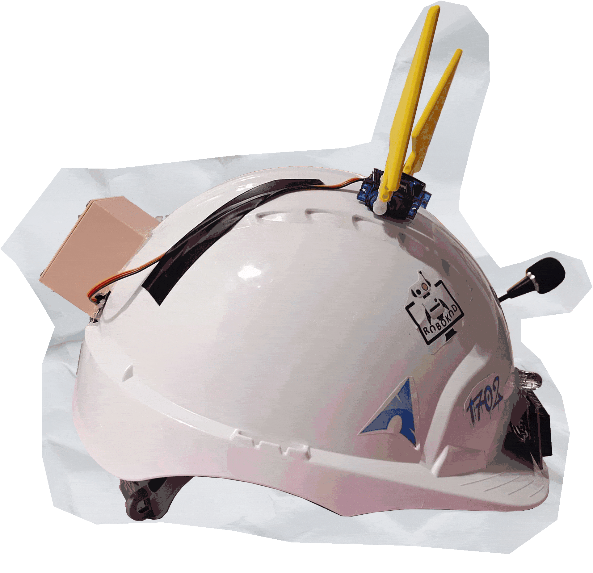
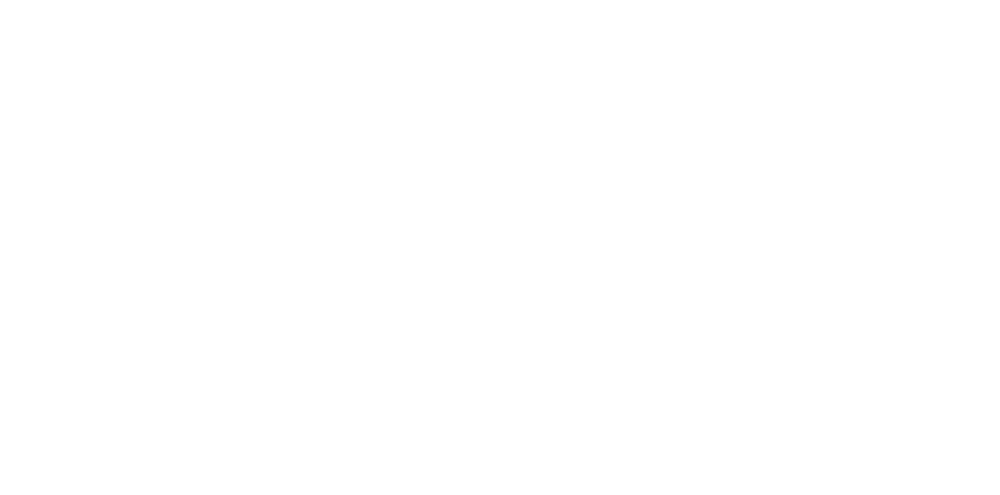

# Miles' Hard Hat

A wearable project inspired by my fursona featuring voice control, animated ears, and visual feedback.

---

## How it works

The [Voice Recognition Module V3](https://www.elechouse.com/product/speak-recognition-voice-recognition-module-v3/) listens for pre-trained commands and sends signals to the microcontroller, which then activates the appropriate output device.

**Simple in theory, but really sick in practice.**

---

## Features

* Voice-controlled actions
* Animated servo ears
* RGB lighting feedback
* LCD status display

---

## Requirements

### Hardware

* Arduino Nano *(may upgrade to ESP32)*
* 2× Servo motors (ears)
* RGB LED
* I2C LCD
* Hard hat

*I currently don’t have access to the 3D models used for the ears and casing, but I’ll add them as soon as I do.*

---

### Software

* Arduino IDE
* `Servo.h` library *(Arduino Library Manager)*
* `LiquidCrystal_I2C.h` library *(Arduino Library Manager)*
* [VoiceRecognitionV3.h](https://www.elechouse.com/elechouse/images/product/VR3/VoiceRecognitionV3.zip)

---

## Wiring

* D2 → TX (Voice Recognition Module)
* D3 → RX (Voice Recognition Module)
* D4 → Red (RGB LED)
* D5 → Green (RGB LED)
* D6 → Blue (RGB LED)
* D7 → Servo 1
* D8 → Servo 2

---

## Future Plans

* Upgrade to ESP32
* Add wireless control (Bluetooth/Wi-Fi)
* Improve voice recognition reliability
* Release 3D models

---
# Miles' Hard Hat
---
I recreated Miles', my fursona's, Hard Hat in real life!

---

## How it works?

The  recognises one of the previously trained commands and sends a signal to the microcontroller telling it to activate the right output device.

